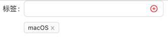

# Business components implementation 

---

## TagInputCom

◆ Combine Input and Tag (based on antd) into a new component

◆ Can be managed as a custom component, unified by Form

## SingleTree

◆ Single selection based on Tree(antd)

